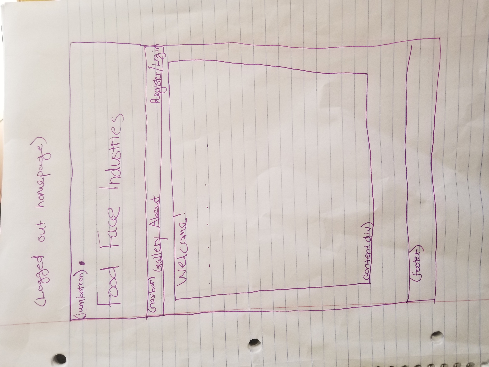
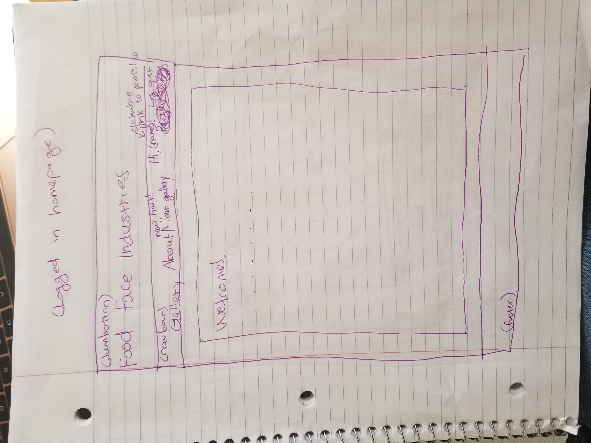
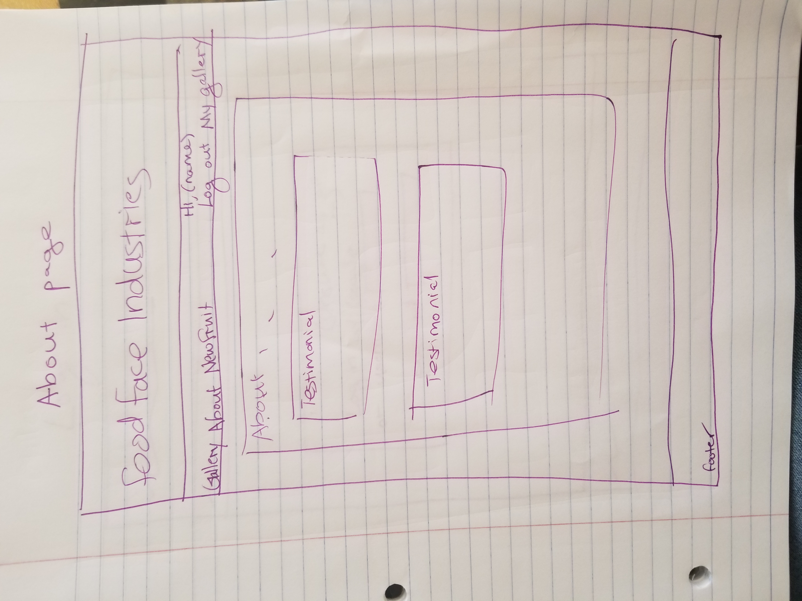
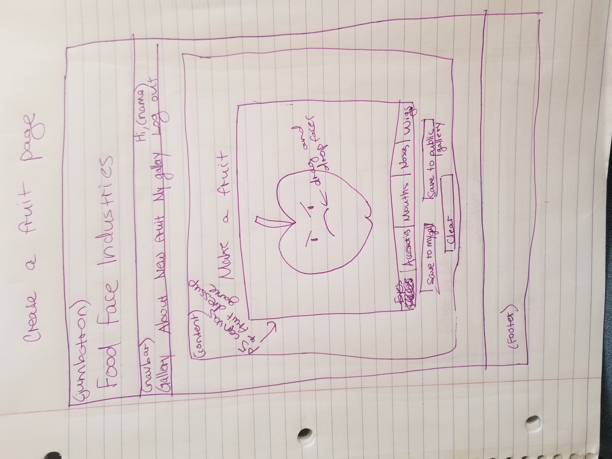
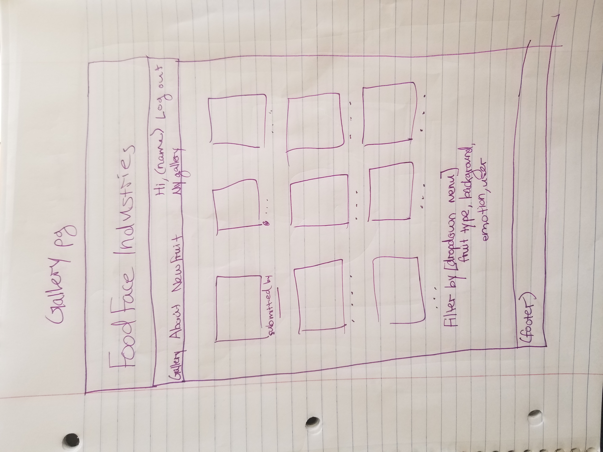
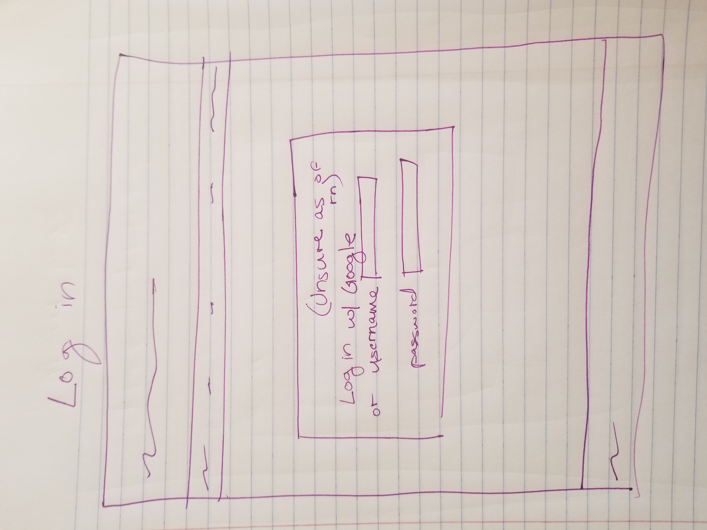

The content below is an example project proposal / requirements document. Replace the text below the lines marked "__TODO__" with details specific to your project. Remove the "TODO" lines.

(___TODO__: your project name_)

# FoodFace Industries

## Overview

(___TODO__: a brief one or two paragraph, high-level description of your project_)

FoodFace Industries is a revolutionary (well, not really) website where you can do the kind of thing you've always dreamed of.  That's right; I'm talking a full on user interactive fruit experience.  By interactive, I mean making beautiful fruit with customized features and faces.

This website will consist of user login to create their own fruits with a p5.js "dressup game" type interface.  The user can then export their fruit to the gallery, where anyone can go and view different fruits that have been created by themselves and other users.


## Data Model


The application will store users, their image data (may store as JSON data to be interpreted, may store as image file), and all user's image data in one big global gallery.


An Example User:

```javascript
{
  username: "laurentheawesome",
  hash: // a password hash,
  fruits: //a list of fruits made from the mongo schema
}
```

An Example Accessory Object (they go on fruits)

```javascript
{
  xPos: //number representing x coordinate of the accessory on the fruit image
  yPos: //number representing y coordinate of the accessory on the fruit image

  name: //string representing the name of the accessory

  xSize: //number representing the width of the accessory
  ySize: //number representing the height of the accessory
}
```
An Example Fruit Image if Stored as a mongo object:

```javascript
{
  user: //reference to a user object who created the fruit
  fruit-type: //type of fruit in the user's image
  accessories: //list of accessory objects
}
```


## (db.js) 


## Wireframes

/home - home page when logged out, and logged in




/about - page about the site with testimonials



/create-a-fruit - page where the user can play the fruit face dressup game



/gallery/slug - page to display the user's own personal gallery, same layout as
/gallery, which displays the global gallery, so both have the same wireframe



/login - page where the user logs in



## Site map

(___TODO__: draw out a site map that shows how pages are related to each other_)

Here's a [complex example from wikipedia](https://upload.wikimedia.org/wikipedia/commons/2/20/Sitemap_google.jpg), but you can create one without the screenshots, drop shadows, etc. ... just names of pages and where they flow to.

## User Stories or Use Cases

(___TODO__: write out how your application will be used through [user stories](http://en.wikipedia.org/wiki/User_story#Format) and / or [use cases](https://www.mongodb.com/download-center?jmp=docs&_ga=1.47552679.1838903181.1489282706#previous)_)

1. as non-registered user, I can register a new account with the site
2. as a user, I can log in to the site
3. as a user, I can create a new grocery list
4. as a user, I can view all of the grocery lists I've created in a single list
5. as a user, I can add items to an existing grocery list
6. as a user, I can cross off items in an existing grocery list

## Research Topics

(___TODO__: the research topics that you're planning on working on along with their point values... and the total points of research topics listed_)

* (5 points) Integrate user authentication
    * I'm going to be using passport for user authentication
    * And account has been made for testing; I'll email you the password
    * see <code>cs.nyu.edu/~jversoza/ait-final/register</code> for register page
    * see <code>cs.nyu.edu/~jversoza/ait-final/login</code> for login page
* (4 points) Perform client side form validation using a JavaScript library
    * see <code>cs.nyu.edu/~jversoza/ait-final/my-form</code>
    * if you put in a number that's greater than 5, an error message will appear in the dom
* (5 points) vue.js
    * used vue.js as the frontend framework; it's a challenging library to learn, so I've assigned it 5 points

10 points total out of 8 required points (___TODO__: addtional points will __not__ count for extra credit_)


## [Link to Initial Main Project File](app.js) 

(___TODO__: create a skeleton Express application with a package.json, app.js, views folder, etc. ... and link to your initial app.js_)

## Annotations / References Used

(___TODO__: list any tutorials/references/etc. that you've based your code off of_)

1. [passport.js authentication docs](http://passportjs.org/docs) - (add link to source code that was based on this)
2. [tutorial on vue.js](https://vuejs.org/v2/guide/) - (add link to source code that was based on this)
